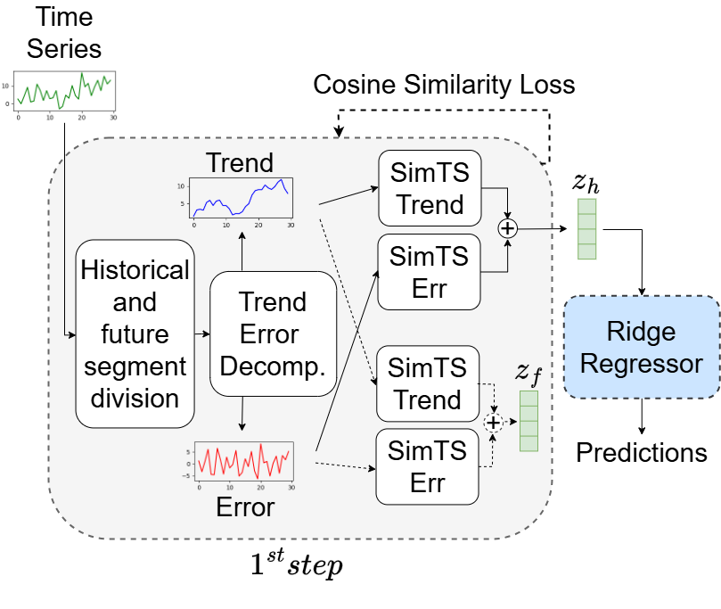

# SimTS: Implementation with 1 - step pipeline

<p align="center">
    
</p>

## Dependencies
A list of dependencies is provided in ```requirements.txt```. After creating a virtual environment, we recommend installing dependencies via ```pip```:

```sh
pip install -r /path/to/requirements.txt
```
## Run the experiments

To run the experiments on the forecasting task use the following command:

```sh
sh forecasting.sh
```

To run the short-term forecasting please add the `--short_term` parameter in each command reported inside the `forecasting.sh` file.

The deafult kernel size is set to 25, to edit it please change the `--kernel_size` parameter.

After training and evaluation, the trained encoder, output, and evaluation metrics can be found in `training/forecasting/B{batch_size}_E{output_repr_dim}/<mode>/DatasetName__RunName_Date_Time/`.

