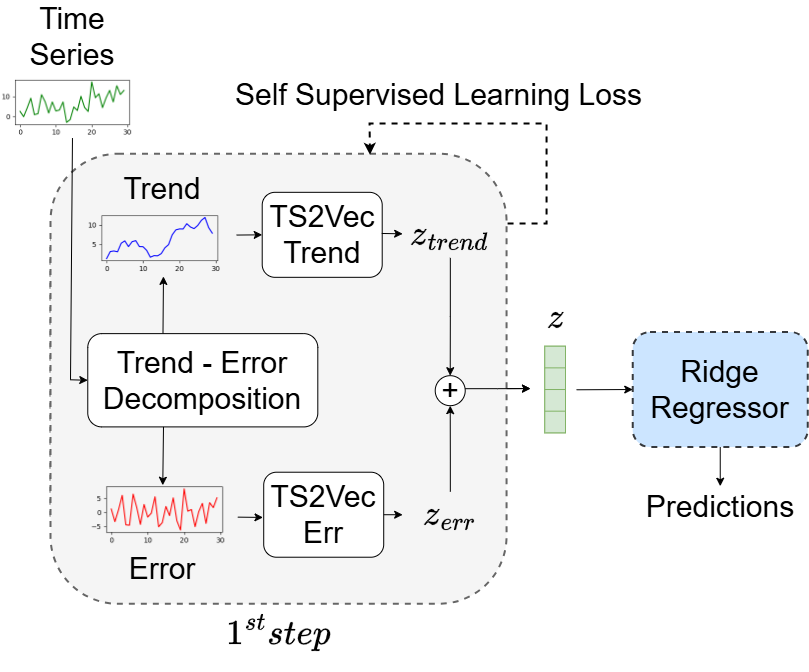

# TS2Vec: implementation with 1 - step pipeline

<p align="center">
  
</p> 

## Requirements

The dependencies can be installed by:
```bash
pip install -r requirements.txt
```

## Usage

To train and evaluate TS2Vec on a dataset for forecasting tasks, run the following command:

```sh
sh forecasting.sh
```

To run the short-term forecasting please add the `--short_term` parameter in each command reported inside the `forecasting.sh` file.

The deafult kernel size is set to 25, to edit it please change the `--kernel_size` parameter.

After training and evaluation, the trained encoder, output, and evaluation metrics can be found in `training/forecasting/B{batch_size}_E{output_repr_dim}/<mode>/DatasetName__RunName_Date_Time/`.


